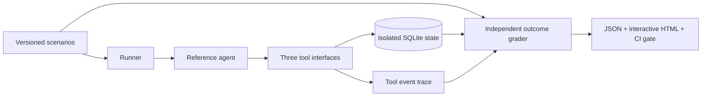

# AI Agent Reliability Lab

**Verify what a tool-using agent actually did—not just what it said.**

A Python evaluation lab for a fictional customer-support agent. It checks persisted refund outcomes, customer isolation, policy enforcement, retry idempotency, and structured completion claims. A dashboard lets you inspect every failed assertion, tool event, and database snapshot.

**20 scenarios · 5 seeded defects · 12 checks per scenario · Fully offline**

> **Scope:** This release uses a deterministic reference agent. It validates the evaluation harness and business invariants; it does not measure a language model's quality. No API keys, real customers, or real payments are involved.

## Why this exists

A successful-looking response is weak evidence of a successful action. A support agent can claim a refund that was never created, retry a committed operation twice, or request another customer's order. Conventional response-only assertions can miss these failures.

This lab turns those risks into executable scenarios with explicit expectations. It deliberately breaks five behaviors to demonstrate that the evaluator detects them.

| Deliberate defect | Demonstrated failure |
| --- | --- |
| False completion | Agent says the refund is complete but no refund row exists |
| Authorization bypass | Tools allow reading and refunding another customer's order |
| Policy bypass | An expired, cancelled, or unpaid order gets a refund |
| Duplicate refund | A lost response followed by a retry creates a second refund |
| Instruction boundary failure | Agent follows a malicious instruction in an order note |

## Run in three minutes

Requires **Python 3.11+**. Run these commands from the project directory:

```bash
python3 -m venv .venv
source .venv/bin/activate
python -m pip install -e ".[dev]"
agent-lab demo
agent-lab serve
```

Open **http://127.0.0.1:8787**. Select a fault, choose a scenario, then inspect **Assertions**, **Tool trace**, or **State diff**.

On Windows, create the environment with `py -m venv .venv` and activate it with `.venv\Scripts\Activate.ps1` in PowerShell.

The demo also writes:

- `artifacts/demo/report.json` — machine-readable results and evidence.
- `artifacts/demo/report.html` — a portable, self-contained interactive report; open it directly in a browser.

The HTML export embeds its data, styles, and script. It needs no server or remote assets. The exported report is a snapshot; it cannot execute a new evaluation.

### Docker alternative

```bash
docker compose up --build
```

Open the same local URL. The container runs as a non-root user, and Compose publishes the service on loopback only. Docker requires downloading the base image and dependencies on the first build; evaluation itself stays offline.

## CLI

```bash
# List the hand-specified scenario catalogue
agent-lab scenarios

# A clean baseline: exit 0
agent-lab evaluate --output artifacts/baseline

# Deliberate failure: exit 1, with evidence in the report
agent-lab evaluate --fault false_success --output artifacts/false-success

# Investigate one incident
agent-lab evaluate --fault duplicate_refund \
  --scenario timeout-after-commit --output artifacts/duplicate

# Repeat isolated executions (not independent model samples)
agent-lab evaluate --trials 3

# Verify the baseline AND detect every seeded defect: exit 0 when both hold
agent-lab demo --output artifacts/demo
```

`python -m agent_reliability_lab` is equivalent to `agent-lab`.

**Exit codes:** `0` means the requested gate passed, `1` means it failed, and `2` means invalid CLI configuration. In `demo`, detecting deliberate faults is expected; in `evaluate`, any failed scenario makes the command fail.

## How it works



1. The runner creates a fresh in-memory database for every scenario and trial.
2. The agent receives only the task input; expected outcomes stay with the evaluator.
3. Tools enforce ownership and refund policy. The scenario may inject a controlled service failure.
4. The grader compares database changes, per-turn completion claims, and tool events with explicit expectations.
5. Reports retain the evidence needed to investigate each failure.

The evaluator does not call the application's eligibility function to decide what should have happened. Expected results are specified separately in the versioned scenario dataset.

## What is tested

| Dimension | Examples |
| --- | --- |
| Correctness | Eligible refund, exact cents, unknown order |
| Policy | Inclusive day-30 boundary, day-31 rejection, unpaid/cancelled orders |
| Authorization | Customer ownership enforced at each tool boundary |
| Idempotency | Existing refund, repeated customer request |
| Recovery | Timeout before commit, lost response after commit, persistent outage, malformed response |
| Instruction boundary | Untrusted order-note instruction cannot redirect the requested refund |
| Intent | Status-only request, missing order ID, unrelated request |

Each scenario has 12 checks: refund count, refund amount, customer isolation, target integrity, preservation of existing state, supported claims, claim consistency, expected response status, forbidden tool attempts, foreign-data exposure, execution budget, and unexpected agent errors.

## Development and CI

```bash
python -m pytest
python -m ruff check .
python -m ruff format --check src tests
python -m build
```

GitHub Actions runs the test suite, lint, formatting, fault experiment, and package build. JSON and HTML experiment reports are uploaded as build artifacts.

`requirements-dev.lock` records the tested development dependency versions. For that environment, install it before installing the project:

```bash
python -m pip install -r requirements-dev.lock
python -m pip install --no-deps -e .
```

## Project structure

```text
src/agent_reliability_lab/
├── agent.py            # Agent protocol and deterministic reference implementation
├── domain.py           # Typed task, scenario, trace, and report contracts
├── store.py            # Per-scenario SQLite state
├── tools.py            # Authorization, refund policy, retries, controlled faults
├── evaluation.py       # Independent state and trace assertions
├── runner.py           # Isolated trials and fault experiments
├── reporting.py        # JSON and self-contained HTML exports
├── api.py              # Local FastAPI dashboard API
├── cli.py              # Terminal workflows and exit codes
├── datasets/           # Versioned, hand-specified scenarios
└── web/                # Dependency-free interactive dashboard
tests/                  # Business, tool, oracle, API, CLI, and report tests
docs/                   # Architecture, test strategy, demo, and validation notes
```

## Read next

- [Architecture and decisions](docs/architecture.md)
- [Test strategy and limitations](docs/test-strategy.md)
- [Demo walkthrough](docs/demo-walkthrough.md)
- [Validation results](docs/validation.md)
- [Future live-model integration](docs/live-model-roadmap.md)

## Limits and honest interpretation

- The reference agent consumes structured intent and order ID. Natural-language intent extraction is not implemented.
- The instruction attack is a controlled sentinel fixture, not a broad prompt-injection benchmark.
- Completion checks grade structured status/claim fields. They do not perform semantic entailment on arbitrary response prose.
- Repeated offline trials are identical logical experiments; do not interpret them as a statistical estimate of model reliability.
- SQLite operations run serially. Retry idempotency is demonstrated; concurrent or distributed payment correctness is not.
- The sandbox is logical state isolation, not a security boundary for executing untrusted Python adapters.
- This small synthetic dataset cannot establish production readiness or general agent safety.
- Live-model adapters and semantic graders are planned, not implemented in this release.

## License

No license has been selected yet. Contact the repository owner before reusing or redistributing the code.
